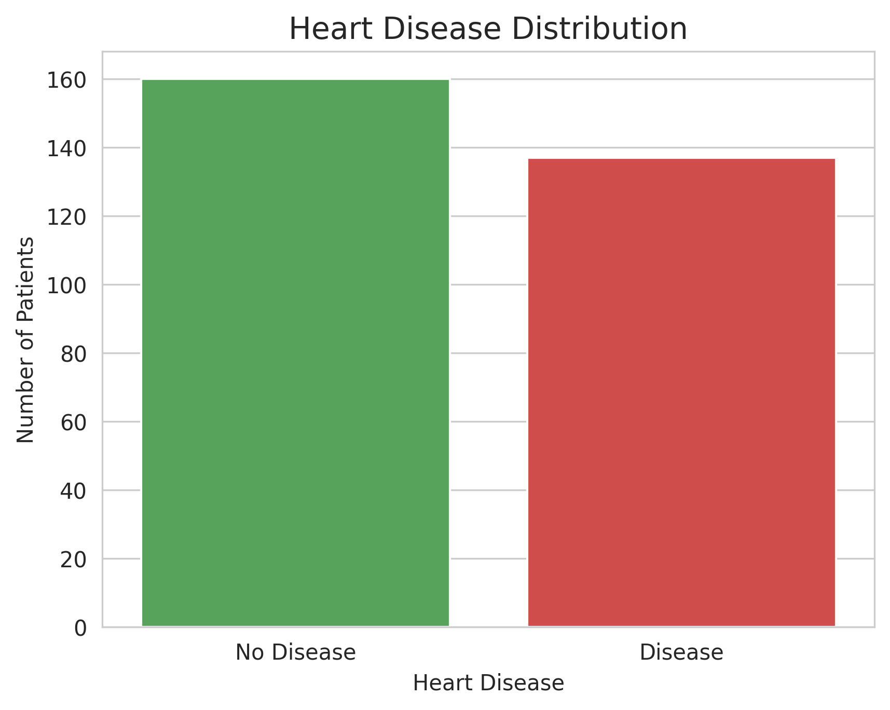
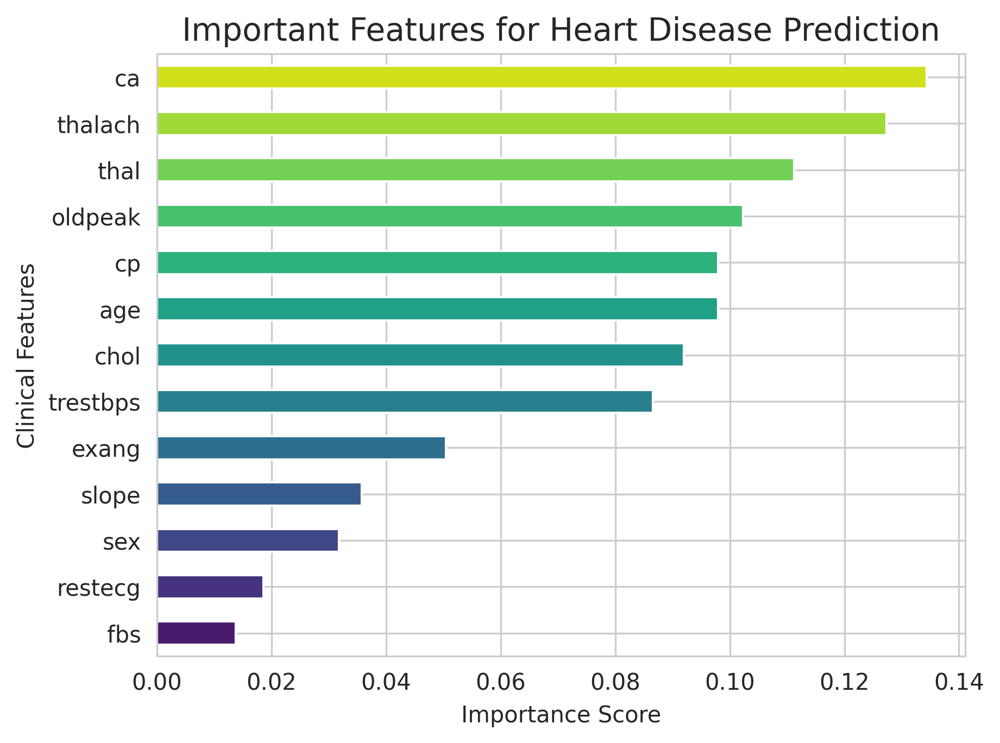

# AI Heart Disease Prediction Model

This project applies machine learning to predict the likelihood of heart disease using clinical patient data.

## Project Overview

Heart disease remains one of the leading causes of death worldwide. Early prediction using clinical indicators can assist healthcare professionals in identifying high-risk patients.

In this project, a Random Forest machine learning model was developed to predict the presence of heart disease based on patient health parameters.

## Dataset

The dataset contains clinical attributes such as:

- Age
- Sex
- Chest pain type
- Blood pressure
- Cholesterol level
- Maximum heart rate achieved
- ST depression induced by exercise
- Number of major vessels

## Methodology

The workflow followed in this project includes:

1. Data loading and exploration
2. Data cleaning and preprocessing
3. Visualization of disease distribution
4. Feature importance analysis
5. Machine learning model training using Random Forest
6. Model evaluation

## Model Performance

The model achieved an accuracy of **88.33%** on the test dataset.

## Key Predictive Features

Feature importance analysis revealed that the most influential predictors were:

- Number of major vessels (ca)
- Maximum heart rate achieved (thalach)
- Thalassemia type (thal)
- ST depression induced by exercise (oldpeak)

## Visualizations

### Heart Disease Distribution

### Feature Importance

## Technologies Used

- Python
- Pandas
- NumPy
- Matplotlib
- Seaborn
- Scikit-learn

## Conclusion

This project demonstrates how machine learning can be applied to healthcare data to support cardiovascular risk prediction and assist in early identification of high-risk patients.